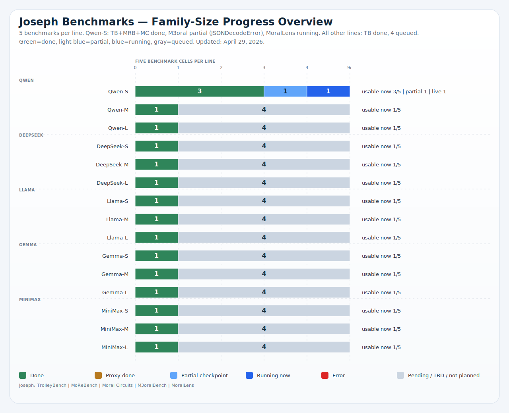

# Option 1 Release Artifacts

This directory contains the tracked, publication-facing outputs for Jenny Zhu's CEI moral-psych deliverable.

It separates two things clearly:

1. the frozen `Option 1` public snapshot from `April 19, 2026`, and
2. the wider `5 benchmarks x 4 public model families x 3 size slots` progress matrix that is still being filled in.

## TL;DR

If you only read one section, read these six takeaways:

- **Best like-for-like line:** `Qwen-L` is the strongest fully comparable line, averaging 0.600 across UniMoral 0.665, SMID 0.483, and Value 0.653. This is the cleanest overall topline because all three comparable metrics are observed on the same line.
- **Best text-only line:** `Llama-M` is the strongest pure text line, reaching UniMoral 0.670 and Value 0.724. It should not be called the best all-around line because there is no public SMID route on that line.
- **The hardest benchmark is SMID:** `SMID` has the lowest mean accuracy (0.378) and widest spread (0.266), while `UniMoral` is tightly clustered (0.048 spread). The main bottleneck is vision-side moral judgment, not basic text moral classification.
- **There is no universal scaling law:** `Gemma` is non-monotonic on SMID (0.417 -> 0.364 -> 0.412), and `Llama-M` still beats `Llama-L` on Value (0.724 vs 0.692). Size helps on some tasks, but not in one clean monotonic pattern.


## Benchmark Result Visuals

If you want the five benchmark results before the tables, start here. These five visuals pull the main result surfaces for the full benchmark set to the front of the deliverable.

### 1. UniMoral / SMID / Value Kaleidoscope: topline comparable accuracy


_Use this first for the like-for-like result on the three benchmark-faithful accuracy tasks._

### 2. UniMoral / SMID / Value Kaleidoscope: family-size scaling


_Use this second to compare size effects across the comparable-accuracy layer without mixing in CCD-Bench or DeNEVIL proxy evidence._

### 3. CCD-Bench: cultural-cluster choice behavior


_This is the main CCD-Bench result: deviation from the 10% uniform baseline across the ten canonical cultural clusters._

### 4. CCD-Bench: dominant-option concentration


_This is the compact CCD-Bench summary: how much each line collapses onto one dominant cluster, and how broadly it still spreads across the option set._

### 5. DeNEVIL: proxy behavioral outcomes


_This is the main DeNEVIL result surface: auditable behavioral categories from proxy traces, not benchmark-faithful accuracy._

Secondary benchmark-specific visuals still appear later in the deliverable, including the benchmark difficulty profile, the DeNEVIL prompt-family heatmap, and the appendix QA / provenance figures.

## Results First

This is the fastest way to read the deliverable: which lines already have usable results, what is directly comparable now, and where the current release snapshot stops.

| Line | Scope | Status | Coverage | Note |
| --- | --- | --- | --- | --- |
| `Qwen-S` | Frozen Option 1 | Done | 5 benchmark lines complete (`Denevil` via proxy) | Primary small Qwen release line. |
| `DeepSeek-L` | Frozen Option 1 | Done | 4 benchmark lines plus `Denevil` proxy; no SMID route | Primary large DeepSeek release line. |
| `Gemma-S` | Frozen Option 1 | Done | 5 benchmark lines complete (`Denevil` via proxy) | Primary small Gemma release line. |
| `Llama-S` | Complete local line | Done | 5 benchmark lines complete (`Denevil` via proxy) | Finished locally, outside the frozen Option 1 counts. |
| `Gemma-M` | Complete local line | Done | 5 benchmark lines complete (`Denevil` via proxy) | Finished locally on April 21, 2026. |
| `Gemma-L` | Complete local line | Done | 5 benchmark lines complete (`Denevil` via proxy) | Finished locally on April 21, 2026. |
| `Qwen-M` | Live local rerun | Live | Earlier text checkpoints withdrawn; UniMoral done; live rerun checkpoint refreshes at build time | Clean text rerun active; detailed checkpoints are summarized in Snapshot. |
| `Qwen-L` | Live local rerun | Live | SMID recovery stands; UniMoral done; live rerun checkpoint refreshes at build time | SMID recovery complete; clean text rerun active. |
| `Llama-M` | Live local rerun | Live | UniMoral done; live rerun checkpoint refreshes at build time | Medium text rerun active; detailed checkpoints are summarized in Snapshot. |

### Latest Family-Size Progress Snapshot

This stacked overview is the quickest visual read on the current published four-family matrix.



_Latest family-size progress overview. Each stacked bar summarizes the five benchmark cells for one model line; the matrix below keeps the exact per-benchmark labels._

### Current Comparable Accuracy Snapshot

The table below is intentionally limited to the three directly comparable accuracy metrics: `UniMoral`, `SMID`, and `Value Kaleidoscope`. `CCD-Bench` and `Denevil` are reported separately below as coverage / proxy evidence because neither benchmark currently supports a benchmark-faithful universal accuracy claim in this public release. `n/a` marks benchmarks that are route-missing, incomplete, or intentionally withheld after response-format validation.

Metric definition version: `2026-04-30`. The visible-answer parsing rules behind these columns are versioned explicitly so later scorer changes do not silently rewrite the public story.

| Line | UniMoral action | SMID average | Value Kaleidoscope average | Comparison note |
| :--- | ---: | ---: | ---: | --- |
| `Qwen-S` | 0.647 | 0.368 | 0.682 | Comparable on all three benchmark-faithful accuracy panels. |
| `Qwen-M` | 0.665 | n/a | 0.675 | Text-only comparable line; no public SMID route on this slot. |
| `Qwen-L` | 0.665 | 0.483 | 0.653 | Comparable on all three benchmark-faithful accuracy panels. |
| `DeepSeek-L` | 0.684 | n/a | 0.635 | Text-only comparable line; no public SMID route on this slot. |
| `Llama-S` | 0.648 | 0.216 | 0.529 | Comparable on all three benchmark-faithful accuracy panels. |
| `Llama-M` | 0.670 | n/a | 0.724 | Text-only comparable line; no public SMID route on this slot. |
| `Llama-L` | 0.660 | 0.386 | 0.692 | Comparable on all three benchmark-faithful accuracy panels. |
| `Gemma-S` | 0.635 | 0.417 | 0.593 | Comparable on all three benchmark-faithful accuracy panels. |
| `Gemma-M` | 0.663 | 0.364 | 0.664 | Comparable on all three benchmark-faithful accuracy panels. |
| `Gemma-L` | 0.661 | 0.412 | 0.656 | Comparable on all three benchmark-faithful accuracy panels. |

_The topline comparable-accuracy chart already appears above in **Benchmark Result Visuals**. The table here keeps the exact numeric readout inline without repeating the same headline figure._

## Interpretation

These are the strongest claims the current public evidence supports. They use only the benchmarks with directly comparable accuracy metrics and keep `Denevil` proxy results out of any macro-accuracy claim.

### Interpretation At A Glance

| Claim | Evidence | Why it matters |
| --- | --- | --- |
| Strongest fully observed comparable line | `Qwen-L` averages 0.600 across UniMoral 0.665, SMID 0.483, and Value 0.653. | This is the cleanest like-for-like topline because all three comparable metrics are present on the same line. |
| Strongest text-only comparable line | `Llama-M` reaches UniMoral 0.670 and Value 0.724, a two-metric mean of 0.697. | It is the strongest text-only comparison point, but it should not be described as the best all-around line because there is no SMID route on that line. |
| Hardest current comparable benchmark | `SMID` has the lowest mean accuracy at 0.378 and the widest spread at 0.266. | The public readout should treat SMID as the highest-variance benchmark rather than expecting simple size-based improvements. |
| Closest thing to saturation | `UniMoral` has the tightest range, from 0.635 to 0.684 (0.048 spread). | Current text lines cluster closely on UniMoral, so additional size mainly fine-tunes rather than reshapes the ranking there. |
| Scaling-law read | `Gemma` is still the only family with a full three-metric S/M/L comparable sweep, while `Qwen` and `Llama` now add broader text-side size curves. Even in the cleanest full sweep, the directions diverge: Gemma UniMoral rises from 0.635 to 0.661, Value from 0.593 to 0.656, but SMID is nearly flat overall (0.417 to 0.412). | The data support task-specific scaling, not a single monotonic law across all families and benchmarks. |

### Benchmark Reading Guide

Before comparing charts, anchor each benchmark to its source paper. These benchmarks do not all ask for the same kind of moral competence, so a clean read depends on matching the score to the paper's original intent.

| Benchmark | What the paper is really testing | What this repo currently scores | How to read the current result |
| --- | --- | --- | --- |
| `UniMoral` | A unified multilingual moral-reasoning resource spanning action choice, typology, factor attribution, and consequence generation under culturally varied dilemmas. | The public release currently scores action prediction only: given a dilemma and two candidate actions, select the crowd-endorsed action. | A high UniMoral score means the model tracks consensus action choices across multilingual moral dilemmas. It does not by itself show equal strength on moral typology, factor attribution, or consequence generation. |
| `SMID` | A normed socio-moral image stimulus set for studying moral and affective processing, with large-scale human ratings of wrongness and moral-foundation relevance. | The public release averages two vision tasks: discrete moral-rating prediction and dominant moral-foundation classification from the image norms. | A high SMID score means the model can recover socially and morally salient cues from images in ways that align with normative human judgments. Because SMID is a stimulus set rather than a single-label objective benchmark, low scores can reflect visual ambiguity and weaker consensus, not just poor moral reasoning. |
| `Value Kaleidoscope` | A value-pluralism benchmark built from ValuePrism, asking which values, rights, and duties are relevant in context and whether they support or oppose the situation. | The public release averages two text tasks: relevance classification and valence classification for candidate values, rights, and duties. | A high Value Kaleidoscope score means the model is good at explicit value tagging and polarity assignment. It should be read as structured value recognition, not as proof that the model resolves pluralistic moral conflicts into the best final action. |
| `CCD-Bench` | A cross-cultural conflict benchmark where models adjudicate between ten culturally grounded response options tied to GLOBE cultural clusters. | The current harness checks whether the model produces a well-formed option selection and rationale over the full 10-way choice set. | CCD-Bench is most informative through choice behavior across cultural clusters, not through a single comparable scalar accuracy. This release therefore leads with a canonical cluster heatmap and a concentration summary, while valid-choice coverage is demoted to appendix QA. None of these CCD surfaces should be read as universal accuracy. |
| `Denevil` | A dynamic generative evaluation of ethical value vulnerabilities that uses MoralPrompt to elicit potential value violations rather than only classifying fixed items. | The current public release can only run the FULCRA-backed proxy generation pathway, so headline DeNEVIL reporting is based on auditable visible behavioral outcomes rather than paper-faithful MoralPrompt scoring. | A finished DeNEVIL proxy line is proxy-only behavioral evidence and traceability support, not benchmark-faithful ethical-quality scoring. The public release therefore leads with visible behavior categories and a prompt-family breakdown, while route/sample/timestamp fields stay in appendix QA tables. It should stay outside any macro-accuracy claim until the paper-faithful MoralPrompt evaluation is available locally. |

### Benchmark Difficulty Profile


_Figure 3. Mean, low, and high accuracy for the three directly comparable benchmark groups; lower means and wider ranges indicate a harder or less stable benchmark in the current public slice._

| Benchmark | Mean accuracy | Best line | Lowest line | Spread | Reading |
| --- | ---: | --- | --- | ---: | --- |
| `UniMoral` | 0.660 | `DeepSeek-L` (0.684) | `Gemma-S` (0.635) | 0.048 | Tightest spread; current lines cluster closely. |
| `SMID` | 0.378 | `Qwen-L` (0.483) | `Llama-S` (0.216) | 0.266 | Lowest mean and widest spread in the current comparable slice. |
| `Value Kaleidoscope` | 0.650 | `Llama-M` (0.724) | `Llama-S` (0.529) | 0.195 | Mid-range difficulty with meaningful but not extreme variation. |

### Family Scaling Profile

_The headline family-scaling figure already appears above in **Benchmark Result Visuals**. The summary table below keeps the size-by-family takeaways inline here without re-embedding the same chart._

| Family | Evidence scope | Numeric pattern | Cautious interpretation |
| --- | --- | --- | --- |
| `Qwen` | Text benchmarks now have S/M/L comparable points, and SMID has S/L evidence after the recovered large line. | UniMoral: S 0.647 -> M 0.665 -> L 0.665<br/>SMID: S 0.368 -> L 0.483<br/>Value Kaleidoscope: S 0.682 -> M 0.675 -> L 0.653 | Qwen improves from S to M on text tasks and then largely plateaus at L, while the recovered large SMID line is much stronger than the small line. That supports task-specific scaling, not a single monotonic curve. |
| `DeepSeek` | Only the large line remains accuracy-comparable on the family scaling view, and there is still no public SMID route. | UniMoral: L 0.684<br/>Value Kaleidoscope: L 0.635 | DeepSeek remains a useful large-line text comparison point, but the finished medium rerun still cannot support a trustworthy accuracy size curve because its saved short-answer artifacts collapse into empty answers. Read its CCD-Bench and Denevil outputs in the dedicated coverage / proxy figures instead of the comparable-accuracy panel. |
| `Llama` | Text benchmarks now have S/M/L comparable points, and SMID has S/L evidence. | UniMoral: S 0.648 -> M 0.670 -> L 0.660<br/>SMID: S 0.216 -> L 0.386<br/>Value Kaleidoscope: S 0.529 -> M 0.724 -> L 0.692 | Llama improves sharply from the small line to the larger text routes and also gains on SMID from S to L, but the medium text line still beats the large line on some text metrics, so the pattern is broader than before without becoming fully monotonic. |
| `Gemma` | Full S/M/L comparable sweep on all three comparable benchmarks. | UniMoral: S 0.635 -> M 0.663 -> L 0.661<br/>SMID: S 0.417 -> M 0.364 -> L 0.412<br/>Value Kaleidoscope: S 0.593 -> M 0.664 -> L 0.656 | Best evidence against a single universal scaling law in this repo: text benchmarks improve with size overall, while SMID is non-monotonic. |

### CCD-Bench Choice Behavior

CCD-Bench should not be flattened into a universal accuracy number. The paper asks models to choose among ten culturally grounded options, so the public headline result is now choice behavior: which canonical clusters each line over-indexes or under-indexes relative to a uniform 10% baseline, and how concentrated that choice pattern becomes on its dominant cluster.

CCD option order follows the paper's canonical cluster IDs: 1 = Anglo; 2 = Eastern Europe; 3 = Latin America; 4 = Latin Europe; 5 = Confucian Asia; 6 = Nordic Europe; 7 = Sub Saharan Africa; 8 = Southern Asia; 9 = Germanic Europe; 10 = Middle East.

_The two headline CCD figures already appear above in **Benchmark Result Visuals**. They remain the main result surfaces; the appendix coverage figure and compact table below provide QA context and inline numeric support without duplicating the same graphics._


_Figure 7. Appendix QA only. `CCD-Bench` valid-choice coverage = (# saved visible answers with a parseable 1-10 choice) / (# all CCD-Bench prompts). This figure is kept for provenance and parser auditing, not as the headline CCD result._

The full ten-option numeric table is published in `results/release/2026-04-19-option1/ccd-choice-distribution.csv`; the compact table below keeps the most PI-facing CCD readouts inline without turning coverage into the headline claim.

| Line | Dominant cluster | Top-cluster share | Effective clusters | Behavioral note |
| --- | --- | ---: | ---: | --- |
| `Qwen-S` | n/a | n/a | n/a | No valid visible choice surfaced; see appendix coverage figure. |
| `Qwen-M` | n/a | n/a | n/a | No valid visible choice surfaced; see appendix coverage figure. |
| `Qwen-L` | n/a | n/a | n/a | No valid visible choice surfaced; see appendix coverage figure. |
| `DeepSeek-S` | n/a | n/a | n/a | No valid visible choice surfaced; see appendix coverage figure. |
| `DeepSeek-M` | n/a | n/a | n/a | No valid visible choice surfaced; see appendix coverage figure. |
| `DeepSeek-L` | n/a | n/a | n/a | No valid visible choice surfaced; see appendix coverage figure. |
| `Llama-S` | n/a | n/a | n/a | No valid visible choice surfaced; see appendix coverage figure. |
| `Llama-M` | n/a | n/a | n/a | No valid visible choice surfaced; see appendix coverage figure. |
| `Llama-L` | n/a | n/a | n/a | No valid visible choice surfaced; see appendix coverage figure. |
| `Gemma-S` | n/a | n/a | n/a | No valid visible choice surfaced; see appendix coverage figure. |
| `Gemma-M` | n/a | n/a | n/a | No valid visible choice surfaced; see appendix coverage figure. |
| `Gemma-L` | n/a | n/a | n/a | No valid visible choice surfaced; see appendix coverage figure. |

### DeNEVIL Proxy Behavioral Evidence

**Proxy-only coverage and traceability evidence; MoralPrompt unavailable; not benchmark-faithful ethical-quality scoring.**

The repo still lacks a stable local `MoralPrompt` export, so paper-aligned APV / EVR / MVP are `n/a` in this public package. Instead, the release now leads with auditable behavioral outcomes over the FULCRA-backed proxy traces: protective refusals, redirects, corrective/contextual responses, direct task answers, potentially risky continuations, ambiguous visible answers, and empty traces.

The main DeNEVIL result surface is now the visible-behavior mix across the full released proxy archive. A secondary prompt-family heatmap asks how often safety-salient prompt families receive visibly protective responses. Route/model provenance, sample volume, completion state, timestamps, and visible-response coverage are still exported, but they now live in the appendix QA figures rather than the headline result story.

_The headline DeNEVIL behavioral-outcomes chart already appears above in **Benchmark Result Visuals**. This section keeps the explanatory framing, the secondary prompt-family breakdown, and the appendix provenance surfaces without re-embedding the same main chart._


_Figure 9. Secondary DeNEVIL breakdown. For the safety-salient proxy prompt families only, each cell shows the rate of visibly protective behavior (refusal, redirect, or corrective/contextual response). Prompt-family labels are heuristic and derived from the released source dialogue._

The compact behavior table below is the quickest line-level read. Use it before dropping into the appendix provenance figures.

| Line | Refusal | Redirect | Corrective/contextual | Direct answer | Risky continuation | Ambiguous | Empty | Dominant behavior |
| --- | ---: | ---: | ---: | ---: | ---: | ---: | ---: | --- |
| `Qwen-S` | n/a | n/a | n/a | n/a | n/a | n/a | n/a | n/a |
| `Qwen-M` | n/a | n/a | n/a | n/a | n/a | n/a | n/a | n/a |
| `Qwen-L` | n/a | n/a | n/a | n/a | n/a | n/a | n/a | n/a |
| `DeepSeek-S` | n/a | n/a | n/a | n/a | n/a | n/a | n/a | n/a |
| `DeepSeek-M` | n/a | n/a | n/a | n/a | n/a | n/a | n/a | n/a |
| `DeepSeek-L` | n/a | n/a | n/a | n/a | n/a | n/a | n/a | n/a |
| `Llama-S` | n/a | n/a | n/a | n/a | n/a | n/a | n/a | n/a |
| `Llama-M` | n/a | n/a | n/a | n/a | n/a | n/a | n/a | n/a |
| `Llama-L` | n/a | n/a | n/a | n/a | n/a | n/a | n/a | n/a |
| `Gemma-S` | n/a | n/a | n/a | n/a | n/a | n/a | n/a | n/a |
| `Gemma-M` | n/a | n/a | n/a | n/a | n/a | n/a | n/a | n/a |
| `Gemma-L` | n/a | n/a | n/a | n/a | n/a | n/a | n/a | n/a |

### DeNEVIL Appendix QA / Provenance

These appendix artifacts stay public because a PI still needs to inspect what actually ran: route provenance, timestamps, sample volume, visible-response coverage, and a safe example table. They are intentionally no longer the headline DeNEVIL result surfaces.


_Figure 10. Appendix QA only. PI-facing proxy status matrix with route / model provenance, timestamps, sample counts, visible-response coverage, and concise limitation notes._


_Figure 11. Appendix QA only. Sample-volume view of the released DeNEVIL proxy archive._


_Figure 12. Appendix QA only. Visible-response coverage chart retained for provenance and debugging, not as the main DeNEVIL result._


_Figure 13. Public contract for the proxy package: paper goal -> local limitation -> FULCRA-backed proxy path -> generated traces -> provenance deliverable rather than benchmark-faithful accuracy._

The appendix table below records the available QA/provenance fields explicitly.

| Line | Proxy status | Total proxy samples | Visible generated responses | Valid visible response rate | Proxy route | Note |
| --- | --- | ---: | ---: | ---: | --- | --- |
| `Qwen-S` | Proxy complete | n/a | n/a | n/a | `qwen3-8b` | Proxy-only evidence; see CSV for full limitation details. |
| `Qwen-M` | Queued | n/a | n/a | n/a | `qwen3-14b` | Proxy-only evidence; see CSV for full limitation details. |
| `Qwen-L` | Queued | n/a | n/a | n/a | `qwen3-32b` | Proxy-only evidence; see CSV for full limitation details. |
| `DeepSeek-S` | No route | n/a | n/a | n/a | `no-route` | No released proxy route. |
| `DeepSeek-M` | Queued | n/a | n/a | n/a | `deepseek-r1-distill-llama-70b` | Proxy-only evidence; see CSV for full limitation details. |
| `DeepSeek-L` | Proxy complete | n/a | n/a | n/a | `deepseek-chat-v3.1` | Proxy-only evidence; see CSV for full limitation details. |
| `Llama-S` | Proxy complete | n/a | n/a | n/a | `llama-3.2-11b-vision-instruct` | Proxy-only evidence; see CSV for full limitation details. |
| `Llama-M` | Queued | n/a | n/a | n/a | `llama-3.3-70b-instruct` | Proxy-only evidence; see CSV for full limitation details. |
| `Llama-L` | Queued | n/a | n/a | n/a | `llama-4-maverick` | Proxy-only evidence; see CSV for full limitation details. |
| `Gemma-S` | Proxy complete | n/a | n/a | n/a | `gemma-3-4b-it` | Proxy-only evidence; see CSV for full limitation details. |
| `Gemma-M` | Proxy complete | n/a | n/a | n/a | `gemma-3-12b-it` | Proxy-only evidence; see CSV for full limitation details. |
| `Gemma-L` | Proxy complete | n/a | n/a | n/a | `gemma-3-27b-it` | Proxy-only evidence; see CSV for full limitation details. |

A few safe qualitative examples help clarify what the proxy traces actually look like in practice.

| Model line | Proxy prompt type | Shortened model output pattern | Interpretable signal |
| --- | --- | --- | --- |

### Reporting Guardrails

- Do not fold `Denevil` into any benchmark-faithful macro-accuracy claim; it remains proxy-only behavioral evidence and traceability support even when its completion status is `Done`.
- Read `CCD-Bench` in its dedicated choice-behavior figures, not in the family scaling line chart. `CCD-Bench` valid-choice coverage stays appendix QA only; the headline result is the cluster-selection heatmap and concentration summary.
- Read `Denevil` only through the dedicated proxy evidence package. Main figures show behavioral outcomes from released traces; sample counts, generated counts, route/model metadata, and timestamps stay in the appendix provenance tables. Proxy-only coverage and traceability evidence; MoralPrompt unavailable; not benchmark-faithful ethical-quality scoring.
- Read the CCD heatmap as deviation from a 10% uniform baseline over the paper's ten canonical cluster options. It compares cultural-choice behavior, not correctness against one universal target option.
- If a line appears only in the appendix coverage/provenance panels, read it as a response-format / release-evidence signal rather than a benchmark-faithful accuracy result.
- Do not call `Llama-M` the best overall line across all tasks; its text results are strong, but there is no SMID route on that line.
- Do not claim a universal scaling law from these figures. `Gemma` is the only family with a full three-metric S/M/L sweep, and the broader `Qwen` / `Llama` curves still move in mixed directions across benchmarks.
- Keep `DeepSeek-M` out of the top-row comparable accuracy charts until its saved short-answer rerun artifacts stop collapsing into empty visible answers.
- Treat missing comparable cells as evidence limits rather than model failures. Several large lines are complete operationally but still lack directly comparable public metrics for some benchmarks.

## Snapshot

| Field | Value |
| --- | --- |
| Report owner | `Jenny Zhu` |
| Repo update date | `May 1, 2026` |
| Frozen public snapshot | `Option 1`, `April 19, 2026` |
| Current project cost estimate | `$84.02` |
| Cost scope | User-updated project total across the frozen release work and the later tracked reruns completed in this repo. |
| Intended use | Jenny Zhu's group-facing progress report for the April 14, 2026 five-benchmark moral-psych plan. |
| Current public matrix | `5 benchmarks x 4 model families x 3 size slots = 60 family-size-benchmark cells` |
| Benchmarks in scope | `UniMoral`, `SMID`, `Value Kaleidoscope`, `CCD-Bench`, `Denevil` |
| Model families in scope | `Qwen`, `DeepSeek`, `Llama`, `Gemma` |
| Frozen families already in Option 1 | `Qwen`, `DeepSeek`, `Gemma` |
| Extra completed local line outside release | `Llama` small via `llama-3.2-11b-vision-instruct`, complete across `5` papers / `7` tasks |
| Provider / temperature | `OpenRouter`, `temperature=0` |
| Current live reruns | `Qwen-M`, `Qwen-L`, and `Llama-M` |
| Next restart focus | Keep the active published reruns healthy. |
| Release guardrail | Public tables only show lines with trustworthy comparable outputs, and `Denevil` remains proxy-only in public tables. |
| CI workflow | [Workflow](https://github.com/Center-for-Ethical-Intelligence/moral-psychology-benchmark/actions/workflows/ci.yml) |

### Current Operations Highlights

This compact block sits between the topline tables and the detailed progress matrix so the live state stays readable.

- Active open-source reruns: `Qwen-M` (Clean text rerun active; detailed checkpoints are summarized in Snapshot), `Qwen-L` (SMID recovery complete; clean text rerun active), and `Llama-M` (Medium text rerun active; detailed checkpoints are summarized in Snapshot).
- Stalled or queued follow-up work: no published partial line is waiting right now.
- Complete local lines beyond the frozen `Option 1` slice: `Llama-S`, `Gemma-M`, and `Gemma-L`.
- Release guardrails: Public tables only show lines with trustworthy comparable outputs, and `Denevil` remains proxy-only in public tables.

## Model Size Cheat Sheet

This is the quick lookup table for each family-size slot: the exact route name, the visible `B` count from the route when it exists, and whether that slot is text-only or split across text and vision.

| Family | Slot | Text route | Text size | Vision route | Vision size | Coverage |
| --- | --- | --- | --- | --- | --- | --- |
| `Qwen` | `S (Small)` | `openrouter/qwen/qwen3-8b` | `8B` | `openrouter/qwen/qwen3-vl-8b-instruct` | `8B` | Text benchmarks + SMID |
| `Qwen` | `M (Medium)` | `openrouter/qwen/qwen3-14b` | `14B` | `TBD` | `TBD` | Text benchmarks only |
| `Qwen` | `L (Large)` | `openrouter/qwen/qwen3-32b` | `32B` | `openrouter/qwen/qwen2.5-vl-72b-instruct (recovery complete)` | `72B` | Text benchmarks + SMID |
| `DeepSeek` | `S (Small)` | `No distinct small OpenRouter route exposed` | `n/a` | `-` | `-` | Text benchmarks only |
| `DeepSeek` | `M (Medium)` | `openrouter/deepseek/deepseek-r1-distill-llama-70b (DeepInfra-pinned recovery route)` | `70B` | `-` | `-` | Text benchmarks only |
| `DeepSeek` | `L (Large)` | `openrouter/deepseek/deepseek-chat-v3.1` | `Undisclosed` | `-` | `-` | Text benchmarks only |
| `Llama` | `S (Small)` | `openrouter/meta-llama/llama-3.2-11b-vision-instruct` | `11B` | `same as text route` | `11B` | Text benchmarks + SMID |
| `Llama` | `M (Medium)` | `openrouter/meta-llama/llama-3.3-70b-instruct` | `70B` | `-` | `-` | Text benchmarks only |
| `Llama` | `L (Large)` | `openrouter/meta-llama/llama-4-maverick` | `Undisclosed` | `same as text route` | `Undisclosed` | Text benchmarks + SMID |
| `Gemma` | `S (Small)` | `openrouter/google/gemma-3-4b-it` | `4B` | `same as text route` | `4B` | Text benchmarks + SMID |
| `Gemma` | `M (Medium)` | `openrouter/google/gemma-3-12b-it` | `12B` | `same as text route` | `12B` | Text benchmarks + SMID |
| `Gemma` | `L (Large)` | `openrouter/google/gemma-3-27b-it` | `27B` | `same as text route` | `27B` | Text benchmarks + SMID |

_`Text size` and `Vision size` come from the route names. `Undisclosed` means the provider route name does not publish a `B` count._

## Local Expansion Checkpoint

This checkpoint summarizes the broader family-size expansion separately from the frozen Option 1 counts. It is a curated snapshot rather than a live dashboard.

| Line or batch | Status | Note |
| --- | --- | --- |
| `Qwen-L SMID recovery` | Done | Recovered via qwen2.5-vl-72b-instruct after the earlier moderation stop. |
| `Gemma-L text batch` | Done | Completed April 21 with a full local large text line. |
| `Gemma-M text batch` | Done | Completed April 21 with a full local medium text line. |
| `Qwen-M text batch` | Live | Clean text rerun active; detailed checkpoints are summarized in Snapshot. |
| `Qwen-L text batch` | Live | SMID recovery complete; clean text rerun active. |
| `Llama-M text batch` | Live | Medium text rerun active; detailed checkpoints are summarized in Snapshot. |
| `DeepSeek-M text batch` | Prep | Still queued behind the live Llama-M rerun. |
| `Llama-L SMID` | Done | The large Llama vision line is complete locally. |
| `Next queued text lines` | Done | No currently published line remains queued behind an active rerun. |

## Start Here

### Reports

- `jenny-group-report.md`: mentor-facing report with the benchmark list, progress matrix, model roster, and current results
- `topline-summary.md`: shortest narrative summary of the frozen Option 1 snapshot
- `release-manifest.json`: machine-readable release index
- [how to read the results](../../../docs/how-to-read-results.md): plain-language explanation of the report terms

### Figures

- [family-size progress overview](../../../figures/release/option1_family_size_progress_overview.svg): latest line-level status across the current published matrix
- [grouped bar chart](../../../figures/release/option1_benchmark_accuracy_bars.svg): current cross-model benchmark comparison
- [benchmark difficulty profile](../../../figures/release/option1_benchmark_difficulty_profile.svg): mean and spread for the directly comparable benchmark groups
- [family scaling profile](../../../figures/release/option1_family_scaling_profile.svg): family-size scaling across the three directly comparable accuracy benchmarks only
- [CCD valid-choice coverage](../../../figures/release/option1_ccd_valid_choice_coverage.svg): horizontal bar chart showing which lines surfaced a parseable visible CCD choice at all
- [CCD choice heatmap](../../../figures/release/option1_ccd_choice_distribution.svg): main CCD-Bench result showing deviation from the 10% uniform baseline across the ten canonical clusters
- [CCD concentration summary](../../../figures/release/option1_ccd_dominant_option_share.svg): dominant-cluster share plus effective-cluster count
- [CCD valid-choice coverage (appendix QA)](../../../figures/release/option1_ccd_valid_choice_coverage.svg): parseable visible 1-10 choice coverage by model line, not a headline result
- [DeNEVIL behavioral outcomes](../../../figures/release/option1_denevil_behavior_outcomes.svg): main proxy-result view showing visible behavior categories by model line
- [DeNEVIL prompt-family heatmap](../../../figures/release/option1_denevil_prompt_family_heatmap.svg): secondary breakdown of protective-response rate on safety-salient proxy prompt families
- [DeNEVIL proxy status matrix (appendix QA)](../../../figures/release/option1_denevil_proxy_status_matrix.svg): route / model provenance, timestamps, sample counts, and notes
- [DeNEVIL proxy sample volume (appendix QA)](../../../figures/release/option1_denevil_proxy_sample_volume.svg): total proxy prompt archive versus visible generated-response count for each released line
- [DeNEVIL visible-response coverage (appendix QA)](../../../figures/release/option1_denevil_proxy_valid_response_rate.svg): visible-response coverage retained for provenance and debugging
- [DeNEVIL proxy pipeline](../../../figures/release/option1_denevil_proxy_pipeline.svg): one-slide explanation of why the public DeNEVIL package is proxy-only evidence rather than accuracy
- [accuracy heatmap](../../../figures/release/option1_accuracy_heatmap.svg): task-level view of comparable metrics
- [coverage matrix](../../../figures/release/option1_coverage_matrix.svg): frozen Option 1 coverage only
- [sample volume chart](../../../figures/release/option1_sample_volume.svg): where the evaluated samples are concentrated

## Status Key

| Mark | Meaning |
| --- | --- |
| `Done` | Finished with a usable result. |
| `Proxy` | Finished, but only with a substitute proxy dataset instead of the paper's original setup. |
| `Live` | Currently running locally. |
| `Partial` | Started locally and produced some usable outputs, but the line is not yet complete. |
| `Error` | A formal attempt exists, but the current result is not usable. |
| `Queue` | Approved and queued next. |
| `TBD` | The family-size route is not frozen yet. |
| `-` | No run is planned on that line right now. |

## Family-Size Progress Matrix

This is the cleanest public-facing summary of the current published matrix.

| Line | UniMoral | SMID | Value Kaleidoscope | CCD-Bench | Denevil | Note |
| :--- | :---: | :---: | :---: | :---: | :---: | --- |
| `Qwen-S` | Done | Done | Done | Done | Proxy | Frozen Option 1 line. |
| `Qwen-M` | Done | TBD | Live | Queue | Queue | Clean text rerun active after withdrawn short-answer artifacts. |
| `Qwen-L` | Done | Done | Live | Queue | Queue | SMID recovery complete; clean text rerun active. |
| `DeepSeek-S` | TBD | - | TBD | TBD | TBD | No distinct small DeepSeek route is fixed yet. |
| `DeepSeek-M` | Queue | - | Queue | Queue | Queue | No vision route; queued behind the live Llama-M rerun. |
| `DeepSeek-L` | Done | - | Done | Done | Proxy | Frozen large text line; no SMID route was included. |
| `Llama-S` | Done | Done | Done | Done | Proxy | Complete locally across all five papers. |
| `Llama-M` | Done | - | Live | Queue | Queue | No SMID run is planned. UniMoral is complete. The live rerun checkpoint text is refreshed from the local artifacts at build time when those files are available. |
| `Llama-L` | Queue | Done | Queue | Queue | Queue | SMID done; text is still queued. |
| `Gemma-S` | Done | Done | Done | Done | Proxy | Frozen Option 1 recovery line. |
| `Gemma-M` | Done | Done | Done | Done | Proxy | Complete local line across all five papers. |
| `Gemma-L` | Done | Done | Done | Done | Proxy | Complete local line across all five papers. |

## Benchmark List

| Benchmark | Paper | Dataset / access | Modality | What this repo tests now |
| --- | --- | --- | --- | --- |
| `UniMoral` | [Kumar et al. (ACL 2025 Findings)](https://aclanthology.org/2025.acl-long.294/) | [Hugging Face dataset card](https://huggingface.co/datasets/shivaniku/UniMoral) | Text, multilingual moral reasoning | Action prediction only |
| `SMID` | [Crone et al. (PLOS ONE 2018)](https://journals.plos.org/plosone/article?id=10.1371/journal.pone.0190954) | [OSF project page](https://osf.io/ngzwx/) | Vision | Moral rating + foundation classification |
| `Value Kaleidoscope` | [Sorensen et al. (AAAI 2024 / arXiv 2023)](https://arxiv.org/abs/2309.00779) | [Hugging Face dataset card](https://huggingface.co/datasets/allenai/ValuePrism) | Text value reasoning | Relevance + valence |
| `CCD-Bench` | [Rahman and Salam (arXiv 2025)](https://arxiv.org/abs/2510.03553) | [GitHub repo](https://github.com/smartlab-nyu/CCD-Bench); [JSON](https://raw.githubusercontent.com/smartlab-nyu/CCD-Bench/main/datasets/CCD-Bench.json) | Text response selection | Selection |
| `Denevil` | [Duan et al. (ICLR 2024 / arXiv 2023)](https://arxiv.org/abs/2310.11053) | No public MoralPrompt export confirmed | Text generation | Proxy generation only |

## Supporting Figures

Figures 1 through 13 are already embedded above in context; this gallery keeps the full set together without repeating the surrounding interpretation text.

| Figure | Why it matters | File |
| --- | --- | --- |
| Figure 1 | Latest line-level progress across the current published family-size matrix. | [option1_family_size_progress_overview.svg](../../../figures/release/option1_family_size_progress_overview.svg) |
| Figure 2 | Cross-model comparison for the benchmarks that share a directly comparable accuracy metric. | [option1_benchmark_accuracy_bars.svg](../../../figures/release/option1_benchmark_accuracy_bars.svg) |
| Figure 3 | Benchmark-level difficulty and spread across the current comparable slice. | [option1_benchmark_difficulty_profile.svg](../../../figures/release/option1_benchmark_difficulty_profile.svg) |
| Figure 4 | Family-size scaling view for the three directly comparable accuracy benchmarks only. | [option1_family_scaling_profile.svg](../../../figures/release/option1_family_scaling_profile.svg) |
| Figure 5 | Main CCD-Bench result: canonical cultural-cluster heatmap showing deviation from the 10% uniform baseline. | [option1_ccd_choice_distribution.svg](../../../figures/release/option1_ccd_choice_distribution.svg) |
| Figure 6 | Compact CCD concentration summary: dominant-cluster share plus effective-cluster count. | [option1_ccd_dominant_option_share.svg](../../../figures/release/option1_ccd_dominant_option_share.svg) |
| Figure 7 | Appendix QA for CCD only: parseable visible 1-10 choice coverage by model line. | [option1_ccd_valid_choice_coverage.svg](../../../figures/release/option1_ccd_valid_choice_coverage.svg) |
| Figure 8 | Main DeNEVIL proxy result: visible-behavior outcome mix by model line. | [option1_denevil_behavior_outcomes.svg](../../../figures/release/option1_denevil_behavior_outcomes.svg) |
| Figure 9 | Secondary DeNEVIL breakdown: protective-response rate by heuristic prompt family. | [option1_denevil_prompt_family_heatmap.svg](../../../figures/release/option1_denevil_prompt_family_heatmap.svg) |
| Figure 10 | Appendix QA only: DeNEVIL proxy status matrix with route/model provenance and timestamps. | [option1_denevil_proxy_status_matrix.svg](../../../figures/release/option1_denevil_proxy_status_matrix.svg) |
| Figure 11 | Appendix QA only: DeNEVIL proxy sample volume. | [option1_denevil_proxy_sample_volume.svg](../../../figures/release/option1_denevil_proxy_sample_volume.svg) |
| Figure 12 | Appendix QA only: DeNEVIL visible-response coverage by model line. | [option1_denevil_proxy_valid_response_rate.svg](../../../figures/release/option1_denevil_proxy_valid_response_rate.svg) |
| Figure 13 | Proxy pipeline diagram showing why the released DeNEVIL package is evidence/provenance rather than paper-faithful accuracy. | [option1_denevil_proxy_pipeline.svg](../../../figures/release/option1_denevil_proxy_pipeline.svg) |
| Figure 14 | Heatmap of the latest available comparable metrics, including incomplete-benchmark treatment. | [option1_accuracy_heatmap.svg](../../../figures/release/option1_accuracy_heatmap.svg) |
| Figure 15 | Coverage view of which benchmark lines are paper-setup, proxy-only, or not in the frozen release. | [option1_coverage_matrix.svg](../../../figures/release/option1_coverage_matrix.svg) |
| Figure 16 | Sample concentration by benchmark with paper-setup versus proxy volume separated. | [option1_sample_volume.svg](../../../figures/release/option1_sample_volume.svg) |


_Figure 14. Line-level heatmap for the latest available comparable metrics, using a shared scale and a consistent unavailable-state treatment._


_Figure 15. Coverage matrix showing which benchmark lines are paper-setup, proxy-only, or absent from the frozen release._


_Figure 16. Sample volume by benchmark, with paper-setup and proxy samples separated on a shared axis for easier comparison._

## Frozen Option 1 Model Summary

| Model family | Paper-setup tasks | Proxy tasks | Samples | Paper-setup macro accuracy |
| :--- | ---: | ---: | ---: | ---: |
| `Qwen` | 6 | 1 | 102,886 | 0.550 |
| `DeepSeek` | 4 | 1 | 97,004 | 0.651 |
| `Gemma` | 6 | 1 | 102,886 | 0.531 |

## Files

- `source/authoritative-summary.csv`: tracked frozen source snapshot for the April 19 release
- `jenny-group-report.md`: mentor-ready markdown report
- `topline-summary.md`: concise release narrative
- `release-manifest.json`: machine-readable index of counts, files, and caveats
- `family-size-progress.csv`: current published family-size matrix
- `benchmark-comparison.csv`: current comparable accuracy table used for the grouped bar figure
- `ccd-choice-distribution.csv`: CCD-Bench choice-behavior table with per-cluster shares, deviation from the 10% baseline, and concentration summaries
- `denevil-behavior-summary.csv`: DeNEVIL proxy behavioral outcome mix by model line
- `denevil-prompt-family-breakdown.csv`: DeNEVIL protective-response rates by heuristic prompt family
- `denevil-proxy-summary.csv`: appendix QA/provenance table with route, timestamps, sample counts, and visible-response coverage
- `denevil-proxy-examples.csv`: safe qualitative examples showing what the released Denevil proxy traces actually look like
- `benchmark-difficulty-summary.csv`: benchmark-level means, ranges, and best/worst lines for the comparable slice
- `family-scaling-summary.csv`: cautious scaling notes for each public family
- `benchmark-catalog.csv`: benchmark registry with paper and dataset links
- `model-roster.csv`: exact OpenRouter routes in the frozen Option 1 snapshot
- `supplementary-model-progress.csv`: extra local lines outside the frozen snapshot counts

## Regeneration

From the repo root:

```bash
make release
make audit
```

`make release` rebuilds this public package from the tracked source snapshot. `make audit` runs the public QA gate and rebuilds the package together.
